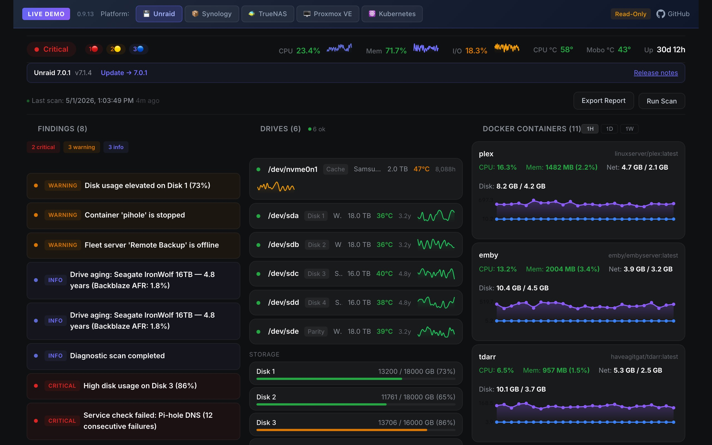
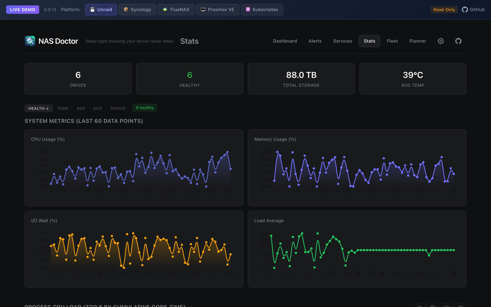
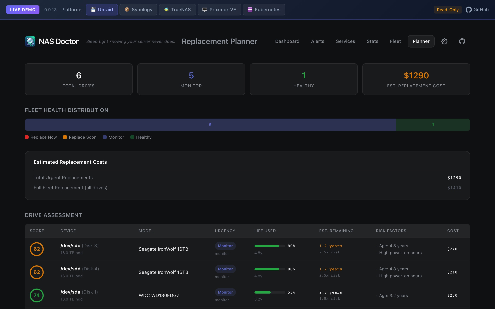
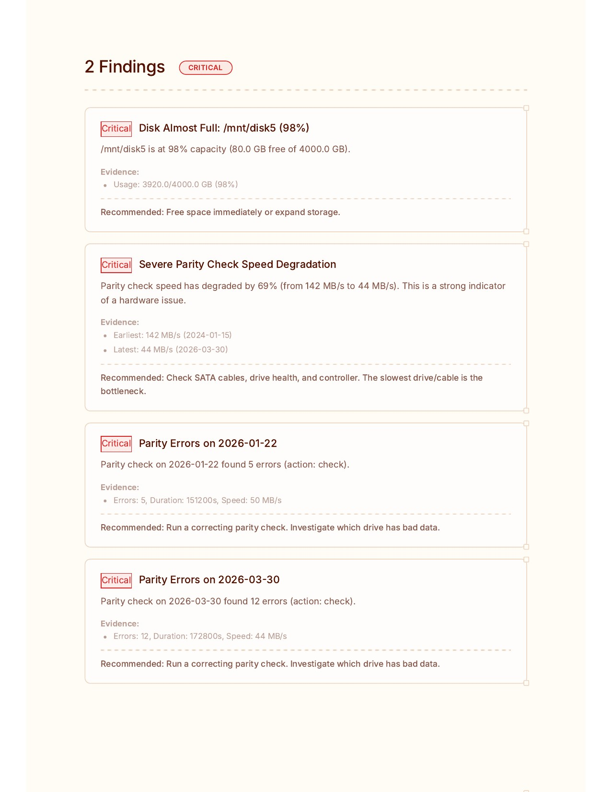
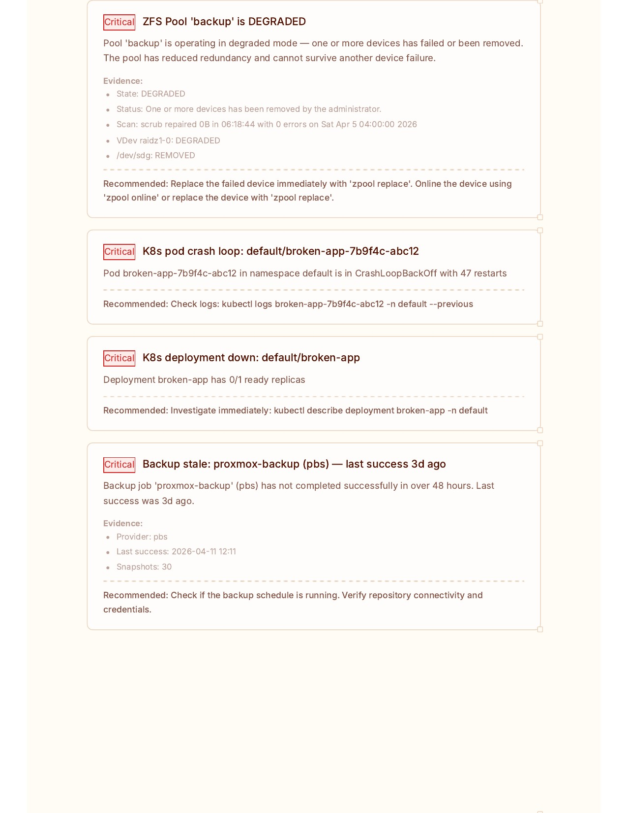
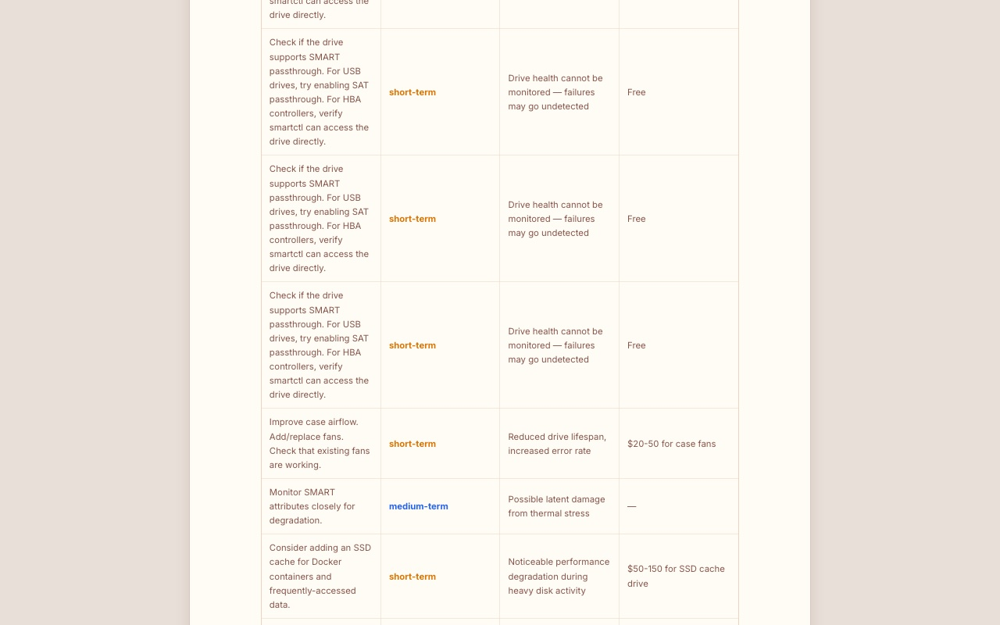

<p align="center">
  
</p>

<h1 align="center">NAS Doctor</h1>

<p align="center">
  <strong><em>Sleep tight knowing your server never does.</em></strong>
</p>

<p align="center">
  <strong>Local NAS diagnostic and monitoring tool.</strong><br>
  Run it as a Docker container on your Unraid, TrueNAS, Synology, Proxmox, or Kubernetes cluster.<br>
  Beautiful dashboards, Prometheus metrics, webhook alerts — no cloud account required.<br>
</p>

> **Beta** — NAS Doctor is in active development. Core features are stable and tested on Unraid. Other platforms may have edge cases. [Report issues here.](https://github.com/mcdays94/nas-doctor/issues)

<p align="center">
  <a href="https://nasdoctordemo.mdias.info"></a>
  <a href="https://buymeacoffee.com/miguelcaetanodias"></a>
</p>

---


NAS Doctor runs periodic health checks on your server — analyzing SMART data, disk usage, Docker containers, GPU, network speed, process CPU, kernel logs, temperatures, ZFS pools, UPS power, and Unraid parity — then surfaces findings with clear severity ratings, root-cause correlation, and actionable recommendations backed by Backblaze failure rate data.

Born from an [OpenCode diagnostic skill](https://github.com/mcdays94/opencode-server-diagnostic-skill) that generates professional PDF server reports, NAS Doctor packages the same intelligence into a self-hosted app anyone can install.

---

## Table of Contents

- [What It Does](#what-it-does)
- [Quick Start](#quick-start)
  - [Docker Compose](#docker-compose-recommended)
  - [Unraid](#unraid--docker-ui-setup)
  - [Synology DSM](#synology-dsm--container-manager)
  - [TrueNAS SCALE](#truenas-scale)
  - [Kubernetes](#kubernetes-k3s--k8s)
  - [Proxmox](#proxmox-ve)
- [Demo](#demo)
- [Configuration](#configuration)
- [API Reference](#api-reference)
- [Project Structure](#project-structure)
- [Platform Support](#platform-support)
- [Diagnostic Report](#diagnostic-report)
- [Agentic Setup](#agentic-setup)
- [Contributing](#contributing)

---

## What It Does

### Diagnostics
- **SMART Health**: Per-drive health, temperature, reallocated sectors, pending sectors, UDMA CRC errors, power-on hours, ATA port mapping, with **Backblaze failure-rate thresholds** (Q4-2025 data, 337k+ drives). By default, NAS Doctor respects drive standby and skips spun-down drives rather than waking them for SMART reads — history will show gaps for drives that spin down, which is intentional (reduces wear). Flip **Wake drives for SMART check** in Settings → Advanced to restore every-cycle polling (v0.9.4 behaviour).
- **Historical Sparklines**: CPU, memory, I/O wait, and per-drive temperature trends inline on the dashboard
- **Disk Space**: Usage per mount point with color-coded thresholds
- **System**: CPU, memory, load average, I/O wait, uptime, platform detection, **CPU package temperature**, **mainboard temperature** (auto-detected via `/sys/class/hwmon`; rendered as colour-coded gauges in the dashboard header alongside CPU/Mem/I/O; gracefully hidden when no sensors are exposed, e.g. on Synology DSM)
- **Docker**: Container listing with status and uptime
- **ZFS Pool Health**: Pool state, vdev tree, scrub/resilver status, ARC hit rate, fragmentation, dataset listing with compression ratios
- **UPS / Power**: Battery level, load, runtime, wattage via NUT or apcupsd (local or remote) — with critical alerts for on-battery and low-battery events
- **Network**: Interface speed negotiation, state, MTU
- **Logs**: Filtered dmesg and syslog errors (ATA errors, I/O errors, medium errors)
- **Parity** (Unraid): Historical parity check speed trend analysis, error tracking
- **Tunnels**: Cloudflared tunnel status (connections, routes) and Tailscale peer graph (IPs, online/offline, relay, exit nodes) — Tailscale detects both host binary (bundled in the image) and Docker containers; Cloudflared detects Docker containers, with host-binary detection requiring a custom image that bundles the `cloudflared` CLI
- **Proxmox VE**: Cluster status, nodes (CPU/mem/uptime), VMs + LXCs (status, resources), storage pools, HA services, recent tasks/backups — via PVE REST API with test connection
- **Kubernetes**: Cluster monitoring for k8s, k3s, EKS, GKE, AKS — nodes (status, disk usage, pod capacity), pods grouped by node with namespace breakdown, deployments, services, PVCs, warning events. In-cluster auto-detection + external token auth. *Tailscale detection in Kubernetes requires a sidecar pod sharing `/var/run/tailscale` via emptyDir — see [docs/tailscale-install-methods.md](docs/tailscale-install-methods.md).*
- **OS Update Check**: Compares installed version against latest GitHub release for Unraid and TrueNAS

### Analysis Engine

20+ diagnostic rules with automatic cross-correlation:

- UDMA CRC errors + slow parity → **Root cause: SATA cable failure**
- High temperatures + slow parity → **Thermal throttling**
- No SSD cache + high I/O wait + Docker containers → **I/O starvation**
- Pending sectors + reallocated sectors → **Failing drive media**
- Reallocated sectors at Backblaze 12.0x failure rate → **Replace immediately**
- ZFS pool DEGRADED with REMOVED vdev → **No redundancy, replace disk**
- UPS on battery with low runtime → **Initiate graceful shutdown**
- OS significantly out of date → **Security vulnerability risk**
- And more...

### Alerts & Incident Management

Dedicated `/alerts` page with:
- **Active Alerts** — acknowledge, snooze, unsnooze with full lifecycle timeline per alert
- **Incident Timeline & Correlation** — correlate alerts against CPU, memory, I/O wait, and disk temperature over selectable windows (24h/7d/30d)
- **Predictive Trend Intelligence** — worsening-pattern detection for SMART counters with urgency scoring, confidence levels, and parity risk markers
- **Notification History** — webhook delivery log with status, error details, and auto-refresh
- **Draggable cards** — reorder, collapse, and toggle card visibility with layout persistence

### Service Checks

Dedicated `/service-checks` page with uptime monitoring:
- **HTTP/HTTPS**, **TCP**, **DNS**, **Ping/ICMP**, **SMB**, **NFS**, **Speed Test** check types
- **Speed checks**: compare download/upload against contracted speeds with configurable margin of error. Three-state result: green (both pass), orange (degraded), red (both fail)
- **Per-check configurable intervals** (30s to 1h) with independent scheduling loop
- **Heartbeat badge cards** — colored dots showing recent check status per service, with favicon for HTTP targets
- **Paginated log table** with filters (check name, status, time range)
- Historical response time tracking and uptime percentages

### Drive Replacement Planner

Dedicated `/replacement-planner` page with proactive drive lifecycle management:
- **Health scoring** per drive — composite score based on age, temperature, SMART attributes, and Backblaze annualized failure rates (337k+ drives, Q4-2025 data)
- **Urgency classification**: Replace Now, Replace Soon, Monitor, Healthy — with color-coded cards
- **Bathtub curve aging model** — failure multiplier increases at infant (<6 months) and wear-out (>4 years) phases
- **Cost estimates** per drive — configurable cost-per-TB in Settings, shows per-drive and total replacement cost
- **Risk factors** — lists specific concerns per drive (age, temperature, reallocated sectors, power-on hours)
- **Remaining life estimate** — projected years remaining based on current age and rated endurance

### Backup Monitoring

Auto-detects and tracks backups from the following tools when their CLI
is reachable from the NAS Doctor container:

- **Borg**, **Restic**, **Proxmox Backup Server (PBS)**, **Duplicati** — probed via `exec.LookPath` at each scan
- Tracks last backup time, size, snapshot count, duration, encryption status
- **Stale backup alerts**: warning >24h, critical >48h, failed backups

> **Note**: Restic, PBS, and Duplicati binaries don't ship in the
> NAS Doctor Docker image. Borg **is** bundled (since v0.9.10; see
> External Borg Monitoring below) and can be pointed at host-managed
> repos via a Read Only bind-mount — no custom image needed. For
> Restic/PBS/Duplicati the Backup dashboard section stays empty unless
> you install the provider CLI inside the container (custom Dockerfile)
> or run the provider in a sibling container that shares volumes/network
> with NAS Doctor.

#### External Borg Monitoring (host-managed repos)

If your Borg setup runs on the **host** (e.g. Unraid User Scripts,
Synology Task Scheduler) rather than inside the NAS Doctor container,
you can still monitor it. Borg is bundled in the image so the **binary
requires no host mount** — just bind-mount the repo path **Read Only**.

> NAS Doctor uses `borg --bypass-lock` to avoid writing to the repo, so
> a Read Only mount is safe. The only theoretical race (read during a
> concurrent `borg create` by the host) produces a momentarily-stale
> archive count until the next scan — no corruption.

Configure in **Settings → Advanced → Backup Monitors → Borg**:

1. **Repo Path** — path to the Borg repo visible inside the container.
   Bind-mount your host's repo location into the container first, as
   **Read Only** (`:ro` or `Mode="ro"`).
   Example: host `/mnt/user/appdata/borg/repo` → container
   `/mnt/user/appdata/borg/repo` (RO).
2. **Label** — optional display name for the dashboard (e.g. `Offsite`).
3. **Passphrase Env Var** — optional, defaults to `BORG_PASSPHRASE`.
   The name of a Docker env var containing the repo's passphrase.
   NAS Doctor **never stores the passphrase itself** — it only reads
   the env var you set on the container.
4. **SSH Key Path** — optional, for `ssh://` remote repos. Absolute
   path inside the container (bind-mount your key file read-only).
5. **Binary Path** — optional override. Leave blank to use the bundled
   binary. Overrides **must be musl-compatible** (the Alpine base image
   can't exec glibc-linked binaries).

Each entry has a **Test** button that probes the repo on demand. Failed
repos render as red error cards on the dashboard with a specific reason
(`binary_not_found`, `repo_inaccessible`, `passphrase_rejected`,
`ssh_timeout`, `corrupt_repo`, `unknown`) so you can tell at a glance
which of your repos needs attention.

**Worked Unraid example** — host runs Borg via User Scripts with repo
at `/mnt/user/appdata/borg/main`, encrypted:

```
# In the Unraid Docker config for nas-doctor:
Path:  /mnt/user/appdata/borg/main  →  /mnt/user/appdata/borg/main (RO)
Env:   BORG_PASSPHRASE              =  <your-passphrase>
```

Then in Settings → Advanced → Backup Monitors → Borg → Add Borg repo:

```
Enabled:           on
Label:             Main
Repo Path:         /mnt/user/appdata/borg/main
Binary Path:       (leave blank — uses bundled borg)
Passphrase Env:    BORG_PASSPHRASE
SSH Key Path:      (leave blank — local repo)
```

Click **Test** to verify; the response shows the archive count on
success or a specific error reason on failure. No container restart
needed — the repo appears on the dashboard at the next scan tick.

### Network Speed Test

- **Live-progress streaming during a test** — when a manual or scheduled test runs, the dashboard speed-test card grows a strip showing the active phase (`LATENCY → DOWNLOAD → UPLOAD`), a sweeping gauge with current Mbps, a big numeric readout, and a mini sparkline of recent samples. Streamed via Server-Sent Events; multi-tab and reconnect-mid-test work transparently (full sample replay on reconnect). **Best-effort through reverse proxies**: some configurations (notably Cloudflare Access / Tunnel) buffer SSE event lines until the response completes, so the strip may stay frozen on `0 MBPS` until the test ends and the final result lands. Direct-LAN access streams smoothly; the final result + per-sample history work correctly in both cases.
- **"Run now" button** on the speedtest card — idempotent. Kicks off a one-off test or attaches to one already in flight. Bypasses the "Disabled" cron setting (Disabled governs *scheduled* tests, not manual runs).
- **Engine**: bundled `showwin/speedtest-go` (pure Go, primary). Falls back to bundled Ookla CLI if the primary engine errors. Each historical row records which engine produced it; the dashboard caption next to the latest result shows `via {engine}`, and a per-row engine column is exported via Prometheus + the snapshot API so you can correlate cross-engine measurements yourself.
- **Per-sample history** — every test's per-sample throughput is persisted in a `speedtest_samples` table. Expand any past type=speed entry on `/service-checks` to see how throughput evolved during that test window.
- **Empty-state from history** — fresh installs and cold-starts render the most-recent successful test from history with a "Last test: X ago" relative-time caption rather than waiting for the next cron tick.
- Download, upload, latency, jitter with historical charts (1H/1D/1W).
- Independent 4-hour schedule (configurable, or "Disabled" for metered connections).
- Server name, ISP, and external IP reported.

### Tunnel Monitoring

Automatic detection and monitoring of remote access tunnels:
- **Cloudflared**: Tunnel status, connection count, ingress routes — detects Docker containers out of the box. Host-binary detection requires a custom image that bundles the `cloudflared` CLI (the default image bundles `tailscale` but not `cloudflared`).
- **Tailscale**: Full peer graph (online status, IPs, OS, relay regions, TX/RX bytes, exit node status) **when the host daemon socket `/var/run/tailscale` is accessible via bind-mount**. A plain-text `tailscale status` fallback captures a reduced subset (IPs, hostnames, OS, online state) when JSON output is unavailable due to CLI-daemon version skew. When the daemon is unreachable the dashboard surfaces an actionable hint explaining what to mount.
- Docker-container detection matches `tailscale` by default; opt-in env var `NAS_DOCTOR_TAILSCALE_CONTAINER_NAMES=ts-sidecar,mullvad-ts,vpn` (comma-separated, case-insensitive substring match) extends detection to custom-named sidecars.
- Dashboard section in all themes with status dots per tunnel/peer
- Full coverage matrix across install methods (host binary, Docker, Kubernetes sidecar) in [docs/tailscale-install-methods.md](docs/tailscale-install-methods.md)

### Top Processes

Real-time process monitoring with Docker container attribution:
- **Dashboard section** — Top 10 processes ranked by CPU%, each tagged with its Docker container name via Linux cgroup matching
- **Click-through** — Click any process to jump to its CPU history chart on `/stats`
- **Historical charts** — Per-process CPU% time series on `/stats` with **1H/1D/1W/1M** range selector
- **Container attribution** — Reads `/proc/PID/cgroup` to match processes to Docker containers. Supports cgroup v1 (Unraid) and cgroup v2 (TrueNAS SCALE)
- **5-minute collection** — Process stats collected every 5 minutes alongside container stats
- **Alert rules** — Configurable `cpu_above` and `mem_above` thresholds per process

> **Requires `--pid=host`** (or `pid: host` in compose) — without it, the container only sees its own processes.

### Parity Detail

Dedicated `/parity` page with full parity check history:
- **Speed trend chart** across all historical checks
- **Expandable detail cards** per check (duration, speed, errors, action, array size, exit code)
- Dashboard shows **scrollable badge pills** sorted newest-first (replaces the old table)

### Notification Rules

Dropdown-driven notification builder with full granularity — no YAML, no complex policy syntax:
- **13 categories**: Findings, Disk Space, Disk Temperature, SMART Health, Service Checks, Process, Parity, UPS/Power, Docker, System, ZFS, Tunnels, Platform Update
- **Condition dropdowns** that change per category — e.g., SMART offers "health fails", "reallocated above", "pending above", "CRC errors above", "power-on hours above"
- **Target selection** from live data — pick a specific drive, service, container, ZFS pool, or tunnel from a dropdown populated by the latest scan
- **Threshold values** — set exact numbers (e.g., disk space below 10%, temp above 55°C)
- **5 one-click presets**: Critical alerts, Disk health watch, Service uptime, Power protection, Storage warnings
- **Quiet Hours** — suppress notifications during a daily time window (alerts still recorded)
- **Maintenance Windows** — scheduled suppression periods per hostname
- **Default Cooldown** — global deduplication window per rule

### API Key Authentication

Per-instance API key system for securing fleet communication:
- **Generate/Copy/Revoke** from Settings — key format `nd-{uuid}`
- All `/api/v1/*` endpoints protected when key is set (including `/health`)
- Dashboard UI exempt (same-origin requests pass through)
- Fleet test validates end-to-end with API key before saving
- Docker HEALTHCHECK and K8s probes use TCP port check (no auth needed)

### Multi-Server Fleet Monitoring

Monitor all your NAS Doctor instances from a visual topology view at `/fleet`:
- **Visual topology** with central primary node and connected remote servers
- Per-server: platform icon, hostname, IP, NAS Doctor version, uptime, health status, finding counts
- **Auto-detect connection type**: LAN (private IP) vs public hostname with tunnel detection (Cloudflare, Tailscale)
- **Custom auth headers** per server for Cloudflare Access, Authelia, etc.
- **Test Connection** validates NAS Doctor signature + API key end-to-end
- **Auto-create service check** when adding a fleet server
- **Edit/Remove** per server with collapsible form
- **Open Dashboard** link to view remote instance directly
- API key required for fleet polling

### Integrations

| Integration | How |
|---|---|
| **Prometheus** | Scrape `/metrics` — 120+ gauges for system (incl. CPU/mobo temps), disk, SMART, Docker, network, UPS, ZFS, GPU, services, parity, tunnels, Proxmox, Kubernetes, backup, speed test (incl. live-test in-progress + per-engine + per-sample-count gauges), findings |
| **Grafana** | Connect via Prometheus data source |
| **Discord** | Webhook with rich embeds, severity colors, finding details |
| **Slack** | Webhook with blocks, severity counts, top findings |
| **Gotify** | Native push notifications with priority mapping |
| **Ntfy** | Push notifications with priority and tags |
| **Generic HTTP** | JSON payload with HMAC-SHA256 signing for custom integrations |

---

## Quick Start

### Docker Compose (recommended)

```yaml
services:
  nas-doctor:
    image: ghcr.io/mcdays94/nas-doctor:latest
    container_name: nas-doctor
    privileged: true          # Required for SMART access
    pid: host                 # Required for Top Processes (see host processes)
    network_mode: host
    volumes:
      - nas-doctor-data:/data
      - /var/run/docker.sock:/var/run/docker.sock:ro
      - /var/log:/host/log:ro
      - /dev:/dev:ro                       # SMART device access
      - /sys:/sys:ro                       # GPU telemetry
      # Mount your storage volumes (platform-specific):
      - /mnt:/host/mnt:ro                  # Unraid, TrueNAS
      # - /volume1:/host/volume1:ro        # Synology (add each volume)
      # - /volume2:/host/volume2:ro        # Synology
      # Unraid-specific (omit on other platforms):
      - /boot:/host/boot:ro
      - /etc/unraid-version:/etc/unraid-version:ro
      - /var/local/emhttp:/var/local/emhttp:ro  # Drive slot mapping (merged drive view)
      # Required IF you run Tailscale (any platform) and want the peer graph:
      - /var/run/tailscale:/var/run/tailscale:ro  # Tailscale peer detection via host daemon socket
    devices:
      - /dev/dri:/dev/dri                  # GPU monitoring (Intel/AMD)
    environment:
      - TZ=Europe/Lisbon
      - NAS_DOCTOR_INTERVAL=30m
    restart: unless-stopped

volumes:
  nas-doctor-data:
```

```bash
docker compose up -d
```

Then open `http://your-nas:8060`. See platform-specific sections below for Unraid, Synology, and TrueNAS configurations.

### Unraid — Docker UI Setup

1. Go to **Docker** tab → scroll down → **Add Container**
2. Fill in the fields:

| Field | Value |
|---|---|
| **Name** | `nas-doctor` |
| **Repository** | `ghcr.io/mcdays94/nas-doctor:latest` |
| **Icon URL** | `https://raw.githubusercontent.com/mcdays94/nas-doctor/main/icons/icon3.png` |
| **WebUI** | `http://[IP]:8060/` (if you change the listen port below, update this to match) |
| **Network Type** | `Host` |
| **Privileged** | `On` (**required** — SMART access needs raw device access) |
| **Extra Parameters** | `--pid=host` (**required** for Top Processes to see host processes) |

3. Add these **path mappings** (click "Add another Path, Port, Variable..." for each):

| Name | Container Path | Host Path | Mode | Why |
|---|---|---|---|---|
| Data | `/data` | `/mnt/user/appdata/nas-doctor` | RW | Database, config, backups |
| Docker Socket | `/var/run/docker.sock` | `/var/run/docker.sock` | RO | Container monitoring |
| Boot Config | `/host/boot` | `/boot` | RO | Parity logs, Unraid ident |
| System Logs | `/host/log` | `/var/log` | RO | dmesg, syslog analysis |
| Host Mounts | `/host/mnt` | `/mnt` | RO | Per-disk space monitoring |
| Unraid Version | `/etc/unraid-version` | `/etc/unraid-version` | RO | OS update detection |
| Disk Slots | `/var/local/emhttp` | `/var/local/emhttp` | RO | Drive slot mapping for merged drive view |
| Device Nodes | `/dev` | `/dev` | RO | SMART and GPU device access |
| Sysfs | `/sys` | `/sys` | RO | GPU telemetry and drive mapping |
| Tailscale Socket | `/var/run/tailscale` | `/var/run/tailscale` | RO | **Required if you use Tailscale** for peer graph detection (`tailscale-nas-util` plugin OR `network_mode: host` Tailscale container). Leave blank if you don't use Tailscale. Without this mount the dashboard surfaces an "Unreachable" hint instead of peer data. |

4. Add these **variables**:

| Key | Value |
|---|---|
| `TZ` | Your timezone (e.g. `Europe/Lisbon`, `America/New_York`) |
| `NAS_DOCTOR_LISTEN` | HTTP listen address, default `:8060`. Change to e.g. `:8067` if port 8060 is in use. Bare port numbers also work (`8067` is normalized to `:8067` automatically). Because the container runs in host networking, this variable — not a Docker port mapping — is how the listen port is set. |

5. Click **Apply**

Then open `http://your-unraid-ip:8060` (or whichever port you set).

> **Important**: Privileged mode and the Host Mounts volume (`/mnt:/host/mnt:ro`) are required. Without privileged, SMART data won't work. Without `/mnt`, per-disk space won't show.
>
> **Changing the port**: Because the container uses host networking, the "Web UI Port" field in the template sets `NAS_DOCTOR_LISTEN` (not a Docker port mapping). If you change it, also update the WebUI URL in Unraid (container settings → Advanced View → WebUI) so the icon opens the right port.

### Synology DSM — Container Manager

Deploy via **Container Manager** (or Docker via SSH).

```yaml
services:
  nas-doctor:
    image: ghcr.io/mcdays94/nas-doctor:latest
    container_name: nas-doctor
    privileged: true
    pid: host
    network_mode: host
    volumes:
      - /volume1/docker/nas-doctor:/data
      - /var/run/docker.sock:/var/run/docker.sock:ro
      - /var/log:/host/log:ro
      - /dev:/dev:ro                       # Required for SMART device access
      - /volume1:/host/volume1:ro
      - /volume2:/host/volume2:ro          # add more volumes as needed
    environment:
      - TZ=Europe/Lisbon
      - NAS_DOCTOR_INTERVAL=30m
    restart: unless-stopped
```

Then open `http://your-synology-ip:8060`.

> **Synology notes**:
> - **Privileged mode is required** for SMART access — `smartctl` needs raw device access via `SYS_RAWIO` capability
> - **Mount `/dev:/dev:ro`** — Synology drive bays use `/dev/sata*` device nodes which must be visible to the container for SMART queries. NAS Doctor automatically tries SCSI-to-ATA translation (`--device=sat`) as a fallback
> - Mount each `/volume<#>` you want monitored — Synology uses `/volume1`, `/volume2`, etc. instead of `/mnt`
> - There is no `/boot` or `/etc/unraid-version` on Synology — omit those mounts
> - Parity analysis is Unraid-specific and will be skipped automatically
> - If SMART still shows warnings, try adding `cap_add: [SYS_RAWIO]` explicitly

### TrueNAS SCALE

Deploy via **Apps** or via SSH with Docker Compose.

```yaml
services:
  nas-doctor:
    image: ghcr.io/mcdays94/nas-doctor:latest
    container_name: nas-doctor
    privileged: true
    pid: host
    network_mode: host
    volumes:
      - /mnt/pool/appdata/nas-doctor:/data
      - /var/run/docker.sock:/var/run/docker.sock:ro
      - /var/log:/host/log:ro
      - /mnt:/host/mnt:ro
      - /dev:/dev:ro                       # Required for SMART device access
      - /sys:/sys:ro                       # Required for GPU monitoring
    devices:
      - /dev/dri:/dev/dri                  # Intel/AMD GPU access (if applicable)
    environment:
      - TZ=America/New_York
      - NAS_DOCTOR_INTERVAL=30m
    restart: unless-stopped
```

Then open `http://your-truenas-ip:8060`.

> **TrueNAS notes**:
> - **Privileged mode is required** for SMART access
> - **Mount `/dev:/dev:ro`** for SMART device access and **`/sys:/sys:ro`** for GPU telemetry
> - **`/dev/dri`** device passthrough enables Intel iGPU monitoring (usage, temperature, power)
> - ZFS pool health, scrub status, ARC hit rate, and dataset listing work automatically
> - Mount `/mnt` to see all pool/dataset storage usage
> - TrueNAS version is detected from `/etc/version` or `/etc/os-release` — no API auth needed
> - Parity analysis is Unraid-specific and will be skipped automatically
> - UPS monitoring works if NUT is configured (TrueNAS has built-in NUT support)

### Kubernetes (k3s / k8s)

Deploy via kubectl or GitOps (ArgoCD/Flux):

```yaml
apiVersion: apps/v1
kind: Deployment
metadata:
  name: nas-doctor
  namespace: nas-doctor
spec:
  replicas: 1
  selector:
    matchLabels:
      app: nas-doctor
  template:
    spec:
      serviceAccountName: nas-doctor
      containers:
        - name: nas-doctor
          image: ghcr.io/mcdays94/nas-doctor:latest
          ports:
            - containerPort: 8060
          env:
            - name: TZ
              value: Europe/Lisbon
          volumeMounts:
            - name: data
              mountPath: /data
          livenessProbe:
            tcpSocket:
              port: 8060
      volumes:
        - name: data
          persistentVolumeClaim:
            claimName: nas-doctor-data
```

You'll also need a ServiceAccount + ClusterRole with read access to nodes, pods, deployments, services, namespaces, PVCs, and events. See the [full K8s manifests](https://github.com/mcdays94/k3s-gitops/tree/main/apps/nas-doctor) for a complete example.

> **K8s notes**:
> - Enable **In-cluster auto-detect** in Settings → Kubernetes (uses mounted service account token)
> - The `view` ClusterRole is NOT sufficient — nodes are cluster-scoped. Use a custom ClusterRole
> - Multi-arch image: runs on amd64 and arm64 (Raspberry Pi) nodes
> - No Docker socket needed — K8s integration uses the API directly
> - Disk usage per node comes from `ephemeral-storage` capacity

### Proxmox (via Ubuntu VM / LXC)

Deploy via Portainer or Docker Compose on a Proxmox VM:

```yaml
services:
  nas-doctor:
    image: ghcr.io/mcdays94/nas-doctor:latest
    container_name: nas-doctor
    privileged: true
    pid: host
    network_mode: host
    restart: unless-stopped
    environment:
      - TZ=Europe/Lisbon
    volumes:
      - nas-doctor-data:/data
      - /var/log:/host/log:ro
      - /var/run/docker.sock:/var/run/docker.sock:ro

volumes:
  nas-doctor-data:
```

Then go to Settings → Proxmox VE, enter your PVE API URL (`https://proxmox:8006`), create an API token (Datacenter → Permissions → API Tokens, uncheck Privilege Separation), and click Test Connection.

> **Proxmox notes**:
> - Self-signed PVE certificates are accepted automatically
> - Node filter dropdown auto-populated from Test Connection
> - Display alias for friendly naming (e.g., "Proxmox LDN")
> - Analyzer detects: node offline, memory critical, storage full, stale backups, HA errors, failed tasks
> - SMART monitoring requires physical disk passthrough to the VM/LXC

### Build from Source

```bash
git clone https://github.com/mcdays94/nas-doctor.git
cd nas-doctor
go build -o nas-doctor ./cmd/nas-doctor
./nas-doctor -listen :8060 -data ./data -interval 30m
```

---

<p>
  
  
</p>
<p>
  
  
</p>
<p>
  
  
</p>
<p>
  
  
</p>
<p>
  
</p>

---

## Settings

All configurable from the web UI at `/settings`, organized with a sticky section nav:

- **General**: Scan interval (preset or custom with cron preview), theme selection, app icon
- **Webhooks**: Add/remove/test Discord, Slack, Gotify, Ntfy, or generic HTTP webhooks with optional custom headers and HMAC signing
- **Notification Rules**: Dropdown-driven rule builder with 13 categories, live target selection, threshold inputs, one-click presets, quiet hours, and maintenance windows
- **Service Checks**: HTTP, TCP, DNS, Ping/ICMP, SMB/NFS uptime monitoring with per-check configurable intervals (30s–1h)
- **Fleet**: Add/remove remote NAS Doctor instances with optional API key auth
- **Dashboard Sections**: Toggle visibility of individual sections (SMART, Docker, ZFS, UPS, Parity, Network, Tunnels, etc.)
- **Data & Retention**: Snapshot retention days, max DB size cap, notification log retention
- **Backup**: Scheduled DB backups with configurable location, interval, and retention count
- **Log Forwarding**: Forward scan results to **Loki**, **syslog** (UDP/TCP), or any **HTTP JSON** endpoint after each scan — with custom headers, labels, and payload format (full, findings only, summary)

### Environment Variables

| Variable | Default | Description |
|---|---|---|
| `NAS_DOCTOR_LISTEN` | `:8060` | HTTP listen address. Accepts `:port`, `host:port`, or bare `port` (normalized). |
| `NAS_DOCTOR_DATA` | `/data` | SQLite database directory |
| `NAS_DOCTOR_INTERVAL` | `30m` | Diagnostic scan interval |
| `NAS_DOCTOR_UPS_NAME` | (auto-detect) | NUT UPS name (skip auto-detect from `upsc -l`) |
| `NAS_DOCTOR_NUT_HOST` | (local) | Remote NUT server host (queries `upsname@host`) |
| `NAS_DOCTOR_APCUPSD_HOST` | (local) | Remote apcupsd daemon `host:port` |
| `TZ` | `UTC` | Timezone |

---

## API Reference

| Endpoint | Method | Description |
|---|---|---|
| `/api/v1/health` | GET | Healthcheck (status, version, uptime) |
| `/api/v1/status` | GET | Server status summary with section visibility |
| `/api/v1/snapshot/latest` | GET | Full latest diagnostic snapshot |
| `/api/v1/snapshot/{id}` | GET | Specific snapshot by ID |
| `/api/v1/snapshots` | GET | List recent snapshots |
| `/api/v1/scan` | POST | Trigger immediate diagnostic scan |
| `/api/v1/history/speedtest` | GET | Speed test history (query: `?hours=N`) |
| `/api/v1/history/processes` | GET | Process CPU/memory history (query: `?hours=N`) |
| `/api/v1/history/containers` | GET | Container stats history (query: `?hours=N`) |
| `/api/v1/history/gpu` | GET | GPU metrics history (query: `?hours=N`) |
| `/api/v1/settings` | GET/PUT | Read/write application settings |
| `/api/v1/settings/test-webhook` | POST | Send test notification to a webhook |
| `/api/v1/sparklines` | GET | Condensed system + SMART history for charts |
| `/api/v1/history/system` | GET | System metrics history (CPU, memory, I/O) |
| `/api/v1/disks` | GET | List all drives with SMART data |
| `/api/v1/disks/{serial}` | GET | Per-drive detail with full SMART history |
| `/api/v1/alerts` | GET | List alerts (filterable by status) |
| `/api/v1/alerts/{id}` | GET | Get single alert detail |
| `/api/v1/alerts/{id}/events` | GET | Alert lifecycle timeline events |
| `/api/v1/alerts/{id}/ack` | POST | Acknowledge an alert |
| `/api/v1/alerts/{id}/unack` | POST | Unacknowledge an alert |
| `/api/v1/alerts/{id}/snooze` | POST | Snooze an alert (with `until` timestamp) |
| `/api/v1/alerts/{id}/unsnooze` | POST | Unsnooze an alert |
| `/api/v1/incidents/timeline` | GET | Incident timeline with system metrics overlay |
| `/api/v1/incidents/correlation` | GET | Alert correlation (before/during/after metrics) |
| `/api/v1/smart/trends` | GET | SMART degradation trends with risk scoring |
| `/api/v1/notifications/log` | GET | Webhook delivery history |
| `/api/v1/service-checks` | GET | Latest service check results |
| `/api/v1/service-checks/history` | GET | Service check result history |
| `/api/v1/service-checks/run` | POST | Trigger service checks immediately |
| `/api/v1/speedtest/run` | POST | Start a speed test (or attach to one in flight). Idempotent — returns `{test_id, started_at, engine}` |
| `/api/v1/speedtest/stream/{test_id}` | GET | Server-Sent Events stream of a live test's progress. Event types: `start`, `phase_change`, `sample`, `result`, `error`, `end` |
| `/api/v1/speedtest/samples/{test_id}` | GET | JSON array of per-sample throughput readings for a completed test (used by the expanded-log mini-chart on `/service-checks`) |
| `/api/v1/findings/dismiss` | POST | Dismiss a finding from the dashboard |
| `/api/v1/findings/restore` | POST | Restore a dismissed finding |
| `/api/v1/db/stats` | GET | Database size and row counts |
| `/api/v1/backup` | GET/POST | List or trigger database backup |
| `/api/v1/fleet` | GET | Aggregated status of all remote servers |
| `/service-checks` | GET | Service checks dashboard (HTML) |
| `/parity` | GET | Parity history detail page (HTML) |
| `/api/v1/fleet/servers` | GET/PUT | Manage remote server list |
| `/api/v1/fleet/test` | POST | Test connectivity to a remote server |
| `/metrics` | GET | Prometheus metrics endpoint |

---

## Prometheus Metrics

All metrics prefixed with `nasdoctor_`. Full list:

<details>
<summary>Expand metric list (120+ metrics)</summary>

```
# System (14 gauges)
nasdoctor_system_cpu_usage_percent / _cpu_cores
nasdoctor_system_memory_used_bytes / _total_bytes / _used_percent
nasdoctor_system_swap_used_bytes / _total_bytes
nasdoctor_system_load_avg_1 / _5 / _15
nasdoctor_system_io_wait_percent / _uptime_seconds
nasdoctor_system_cpu_temp_celsius / _mobo_temp_celsius   # 0 when no sensor available

# Disks (labels: device, mountpoint, label)
nasdoctor_disk_used_bytes / _total_bytes / _used_percent

# SMART (labels: device, model, serial) — 11 gauges per drive
nasdoctor_smart_healthy / _temperature_celsius / _temperature_max_celsius
nasdoctor_smart_reallocated_sectors / _pending_sectors / _offline_uncorrectable
nasdoctor_smart_udma_crc_errors / _command_timeout / _spin_retry_count
nasdoctor_smart_power_on_hours / _size_bytes

# Docker (labels: name, image)
nasdoctor_docker_container_cpu_percent / _memory_bytes / _running
nasdoctor_docker_container_count

# Network (labels: interface)
nasdoctor_network_interface_up / _mtu

# UPS (10 gauges)
nasdoctor_ups_battery_percent / _battery_voltage
nasdoctor_ups_input_voltage / _output_voltage / _load_percent
nasdoctor_ups_runtime_minutes / _wattage_watts / _temperature_celsius
nasdoctor_ups_on_battery / _low_battery

# ZFS (labels: pool for pools, dataset+pool for datasets)
nasdoctor_zfs_pool_healthy / _used_bytes / _total_bytes / _used_percent
nasdoctor_zfs_pool_fragmentation_percent / _scan_percent / _scan_errors
nasdoctor_zfs_pool_read_errors / _write_errors / _checksum_errors
nasdoctor_zfs_arc_size_bytes / _max_size_bytes / _hit_rate_percent
nasdoctor_zfs_arc_hits_total / _misses_total
nasdoctor_zfs_l2arc_size_bytes / _hit_rate_percent
nasdoctor_zfs_dataset_used_bytes / _avail_bytes / _compression_ratio

# Service Checks (labels: name, type, target)
nasdoctor_service_up / _response_ms / _consecutive_failures

# Parity (Unraid)
nasdoctor_parity_speed_mb_per_sec / _duration_seconds / _errors / _running

# Tunnels
nasdoctor_tunnel_cloudflared_up / _connections (labels: name)
nasdoctor_tunnel_tailscale_node_online / _tx_bytes / _rx_bytes (labels: name, ip)

# Proxmox (labels: node / vmid+name+type+node / storage+node+type)
nasdoctor_proxmox_node_cpu_usage / _memory_used_bytes / _memory_total_bytes / _node_online
nasdoctor_proxmox_guest_cpu_usage / _memory_used_bytes / _memory_max_bytes / _guest_running
nasdoctor_proxmox_storage_used_bytes / _storage_total_bytes

# Kubernetes (labels: node / pod+namespace / deployment+namespace)
nasdoctor_k8s_node_ready / _node_pod_count
nasdoctor_k8s_pod_running / _pod_restarts
nasdoctor_k8s_deployment_ready_replicas / _deployment_desired_replicas

# GPU (labels: index, name, vendor) — 10 gauges per GPU
nasdoctor_gpu_usage_percent / _mem_used_mb / _mem_total_mb / _mem_percent
nasdoctor_gpu_temperature_celsius / _power_watts / _power_max_watts / _fan_percent
nasdoctor_gpu_encoder_percent / _decoder_percent

# Backup (labels: provider, name)
nasdoctor_backup_last_success_timestamp / _size_bytes / _status

# Speed Test
nasdoctor_speedtest_download_mbps / _upload_mbps / _latency_ms
nasdoctor_speedtest_in_progress                            # 1 while a test is running
nasdoctor_speedtest_engine{engine="speedtest_go|ookla_cli"}  # 1 for the engine of the most-recent successful test
nasdoctor_speedtest_samples_count{test_id="..."}           # sample count of the most-recent completed test

# Findings
nasdoctor_findings_critical_count / _warning_count
nasdoctor_findings_total{severity="critical|warning|info"}

# Other
nasdoctor_update_available
nasdoctor_collection_duration_seconds / _last_collection_timestamp
```

</details>

---

## Supported Platforms

| Platform | Status | Notes |
|---|---|---|
| **Unraid** | ✅ Tested | Parity analysis, array status, disk labels, OS update check; dogfooded daily |
| **Synology DSM** | ⚠️ Community tested | `/volume<#>` detection, `/dev/mapper/cachedev_*` support, SMART health parsing |
| **TrueNAS SCALE** | ⚠️ Untested | ZFS pool health support built-in, but not yet validated on real hardware |
| **Proxmox VE** | ⚠️ Community tested | PVE REST API integration with cluster + node + VM/LXC views; dogfooded as a fleet peer |
| **Kubernetes** (k3s / k8s) | ⚠️ Community tested | In-cluster auto-detection, ServiceAccount + ClusterRole auth; tested on k3s |
| **QNAP QTS** | ⚠️ Untested | Should work via Container Station |
| **Generic Linux** | ⚠️ Untested | Any distro with Docker |

> Tested on **Unraid** daily. Synology, Proxmox, and Kubernetes have community reports / fleet-peer dogfooding. Other platforms should work but may have edge cases with disk detection, SMART access, or platform-specific features. [Report issues here.](https://github.com/mcdays94/nas-doctor/issues)

### A note from the maintainer

NAS Doctor is maintained by one person, and the only platform I have hands-on every day is **Unraid**. Synology DSM, TrueNAS SCALE, Proxmox VE, Kubernetes/k3s, and Docker-on-Linux are all supported and tested via emulation, captured-snapshot replay, and a couple of community fleet peers — but bugs that would be obvious to me on a box I can poke with my hands tend to surface only when a non-Unraid user reports them.

**If you're running NAS Doctor on Synology, TrueNAS, Proxmox, Kubernetes, or any other non-Unraid host and something looks off — please [open an issue](https://github.com/mcdays94/nas-doctor/issues/new/choose).** Even small UX oddities are useful: "the drive merge view lists my volume twice", "the Proxmox containers widget shows VMs instead of LXCs", "the UPS section is empty even though apcupsd is running". Your reports are how this project stays honest across platforms — they're appreciated, not a burden.

---

## File Structure & Data Locations

### Inside the container (`/data` volume)

```
/data/
├── nas-doctor.db          # SQLite database (snapshots, alerts, history, settings)
└── backups/               # Automatic DB backups (configurable)
    ├── nas-doctor-2026-04-10.db
    └── ...
```

All configuration is stored in the SQLite database and managed via the web UI at `/settings`. There are no config files to edit manually.

### Host bind mounts (read-only)

All bind mounts in one place — match the per-platform Quick Start tables above. Mount only what applies to your platform; everything is RO except `/data`.

| Container path | Host path | Purpose |
|---|---|---|
| `/host/mnt` | `/mnt` | Disk space monitoring (Unraid, TrueNAS, Proxmox) |
| `/host/volume<N>` | `/volume<N>` | Disk space monitoring (Synology — mount each volume) |
| `/host/log` | `/var/log` | System log analysis (dmesg, syslog) |
| `/host/boot` | `/boot` | Parity logs, Unraid identification (Unraid only) |
| `/etc/unraid-version` | `/etc/unraid-version` | Unraid OS detection + update check (Unraid only) |
| `/var/local/emhttp` | `/var/local/emhttp` | Unraid drive slot mapping for merged drive view (Unraid only) |
| `/dev` | `/dev` | SMART and GPU device access |
| `/sys` | `/sys` | GPU telemetry and drive mapping |
| `/var/run/docker.sock` | `/var/run/docker.sock` | Container monitoring (auto-detect Docker) |
| `/var/run/tailscale` | `/var/run/tailscale` | Tailscale peer graph (mount only if you use Tailscale on the host) |

> **External Borg repos** add their own bind-mount entries on top of the table — see [External Borg Monitoring (host-managed repos)](#external-borg-monitoring-host-managed-repos) above for repo-path mount conventions and required env vars.

### Source tree

```
cmd/nas-doctor/            # Entry point, CLI flags, demo mode
internal/
├── analyzer/              # Diagnostic rules engine, Backblaze thresholds
├── api/                   # HTTP handlers, embedded HTML templates, shared CSS
│   └── templates/         # Dashboard themes (midnight, clean) + subpages
├── collector/             # Data collection (SMART, disk, docker, network, UPS, tunnels, sensors)
├── demo/                  # Mock data generation for demo mode
├── fleet/                 # Multi-server fleet polling
├── livetest/              # In-flight speed-test broadcast registry (SSE fan-out + replay)
├── logfwd/                # Log forwarding (Loki, HTTP JSON, syslog)
├── notifier/              # Webhook delivery + Prometheus exporter
├── scheduler/             # Scan scheduling, notification rules, service checks
└── storage/               # SQLite database layer
```

---

## Resource Usage

NAS Doctor is designed to be invisible on your system:

| Resource | During scan (~15s every 30m) | Between scans |
|---|---|---|
| **CPU** | <2% | ~0% |
| **Memory** | ~30-50 MB | ~30-50 MB |
| **Disk I/O** | Read-only: `/proc`, `smartctl`, `dmesg` | Zero |
| **Network** | OS update check (1 req/day) | Serves UI only when accessed |

---

## Demo

**[Live demo: nasdoctordemo.mdias.info](https://nasdoctordemo.mdias.info)** — switch between Unraid, Synology, TrueNAS, Proxmox, and Kubernetes via the toolbar at the top. Read-only, no login. See [demo-worker/README.md](demo-worker/README.md) for how it works.

Each platform renders realistic per-platform telemetry:

- **Drives** — 2–8 SMART drives per platform with Backblaze-informed findings, 30-day temperature sparklines, replacement planner with health scoring, capacity forecast
- **Compute** — 3–11 Docker containers per platform, Top Processes with container attribution, GPU monitoring (Unraid RTX A2000, Proxmox Tesla P4), CPU + mainboard temperature gauges in the header (Unraid, TrueNAS, Proxmox; gracefully hidden on Synology / Kubernetes to showcase the empty-sensor fallback)
- **Storage health** — ZFS pools where applicable (TrueNAS raidz2, Proxmox mirror), UPS power monitoring, parity history (Unraid)
- **Network** — 8 service checks (one per check type: http/tcp/dns/ping/smb/nfs/speed/traceroute) with 7 days of history, 24h speed-test history with `via {engine}` caption on the latest result and per-row engine annotation, expand any speed entry on `/service-checks` for the per-sample throughput chart, Cloudflared + Tailscale tunnels (Unraid + Proxmox)
- **Backups** — Borg / Restic / PBS / Duplicati / rclone repos with healthy + warning + error states, including v0.9.10's external-Borg "CONFIGURED" pill and error-card reason codes
- **Alerts & incidents** — Active + resolved + snoozed alerts, 10-event incident timeline with system-metric correlation, webhook delivery history
- **Fleet** — 4 remote servers with topology view and tunnel-type detection

To run locally with mock data (single-platform Unraid baseline, no NAS needed):

```bash
go build -o nas-doctor ./cmd/nas-doctor
./nas-doctor -demo -listen :8060
```

---

## Diagnostic Report

Click **Export Report** on the dashboard to generate a print-ready diagnostic report. Open in your browser and use Print > Save as PDF. [View demo report (PDF)](docs/nas-doctor-demo-report.pdf).

16 sections: System Overview, Findings, Drive Health & SMART, Docker, GPU, Backup, Speed Test, ZFS, UPS, Network, Service Checks, Proxmox, Kubernetes, Tunnels, Parity, Recommended Actions.

<p>
  
  
  
  
</p>

---

## Agentic Setup

NAS Doctor is also an experiment in how far agentic coding can carry a production-shaped project. The whole thing is written through [opencode](https://opencode.ai), mostly by a mix of Claude Opus 4.7 / 4.6 and GPT Codex 5.3, directed by hand.

In the same spirit, the issue tracker itself is partly automated — an opencode agent triages open issues, posts replies, and drafts PRs. The orchestration uses dedicated agents and sub-agents inspired by [Matt Pocock's](https://www.mattpocock.com/) workflow: a top-level orchestrator that breaks features into independently-shippable pieces and dispatches worker agents to execute them on isolated branches. I wrote up how the setup works in [Cloning Matt Pocock with opencode](https://mdias.info/posts/cloning-matt-pocock-opencode/).

---

## License

MIT
