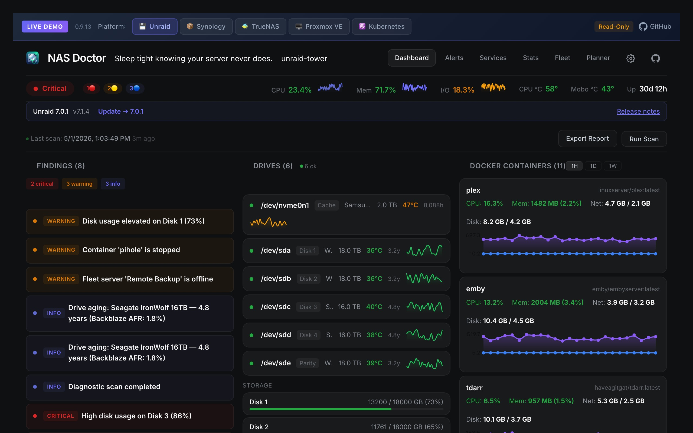
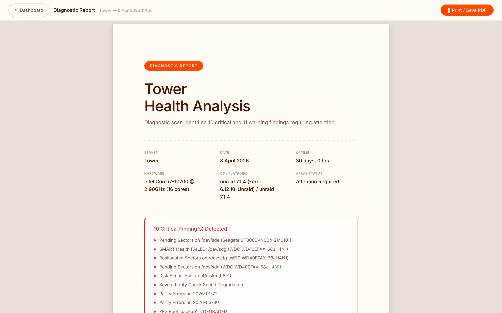
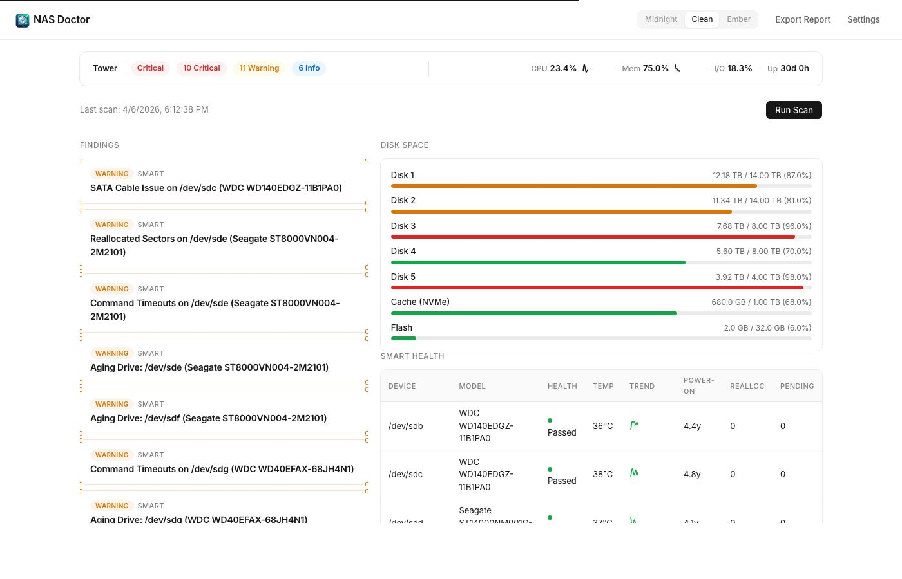
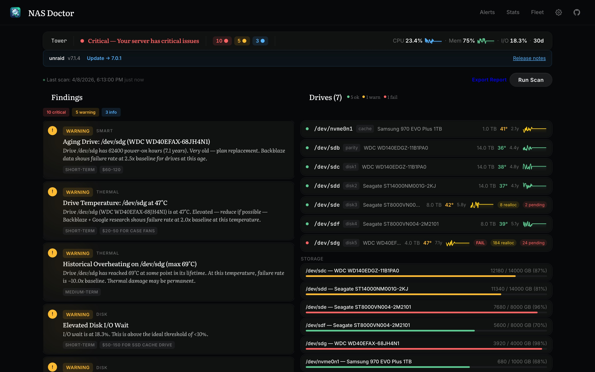
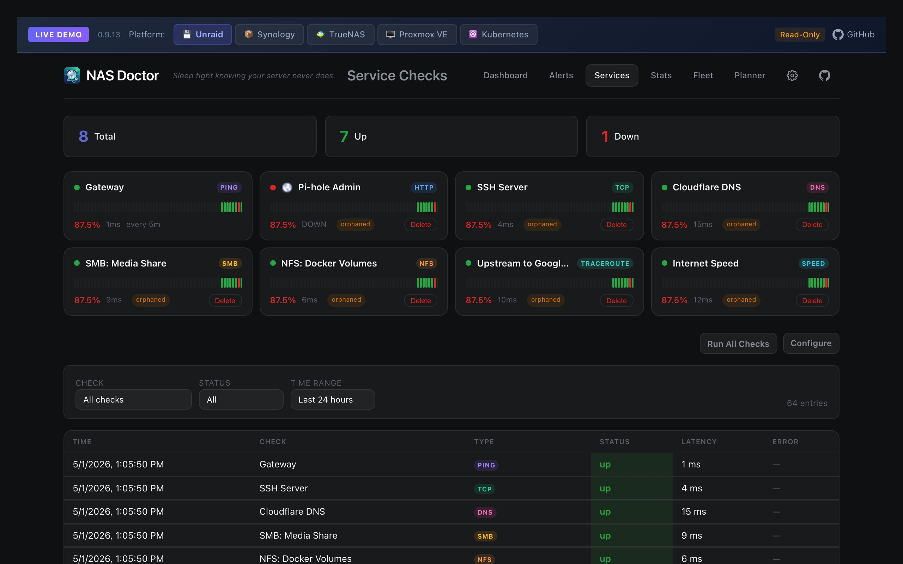
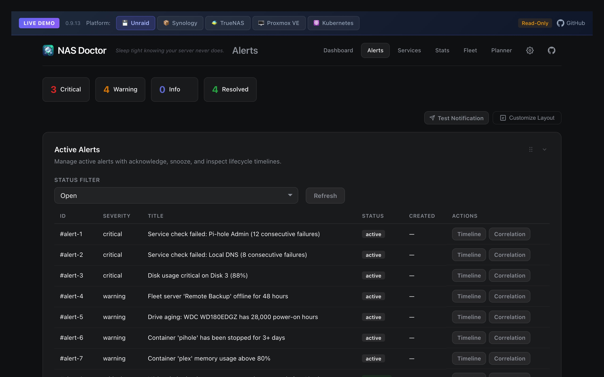
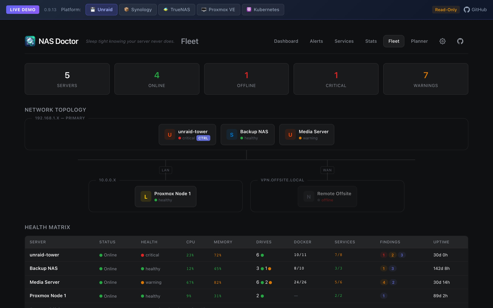
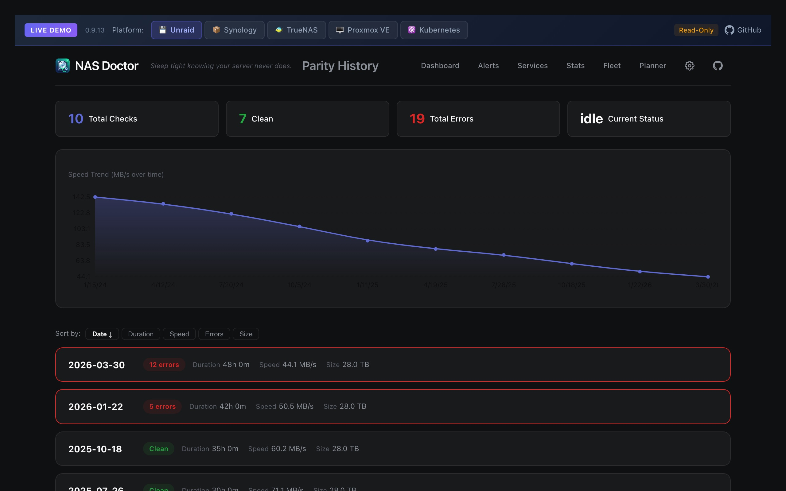
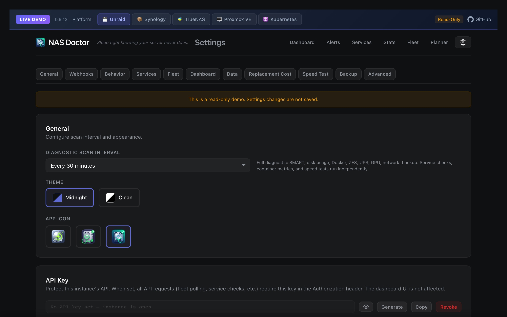

<p align="center">
  
</p>

<h1 align="center">NAS Doctor</h1>

<p align="center">
  <strong><em>Sleep tight knowing your server never does.</em></strong>
</p>

<p align="center">
  <strong>Local NAS diagnostic and monitoring tool.</strong><br>
  Run it as a Docker container on your Unraid, TrueNAS, Synology, Proxmox, or Kubernetes cluster.<br>
  Beautiful dashboards, Prometheus metrics, webhook alerts — no cloud account required.<br>
  <code>amd64</code> + <code>arm64</code> (Raspberry Pi, Apple Silicon)
</p>

> **Alpha** — NAS Doctor is in alpha. Features may be incomplete, bugs are expected, and breaking changes can occur between releases. Only tested on Unraid. [Report issues here.](https://github.com/mcdays94/nas-doctor/issues)

<p align="center">
  <a href="https://nasdoctordemo.mdias.info"></a>
  <a href="https://buymeacoffee.com/miguelcaetanodias"></a>
</p>

---



NAS Doctor runs periodic health checks on your server — analyzing SMART data, disk usage, Docker containers, kernel logs, temperatures, ZFS pools, UPS power, and Unraid parity — then surfaces findings with clear severity ratings, root-cause correlation, and actionable recommendations backed by Backblaze failure rate data.

Born from an [OpenCode diagnostic skill](https://github.com/mcdays94/opencode-server-diagnostic-skill) that generates professional PDF server reports, NAS Doctor packages the same intelligence into a self-hosted app anyone can install.

---

## What It Does

### Diagnostics
- **SMART Health**: Per-drive health, temperature, reallocated sectors, pending sectors, UDMA CRC errors, power-on hours, ATA port mapping, with **Backblaze failure-rate thresholds** (Q4-2025 data, 337k+ drives)
- **Historical Sparklines**: CPU, memory, I/O wait, and per-drive temperature trends inline on the dashboard
- **Disk Space**: Usage per mount point with color-coded thresholds
- **System**: CPU, memory, load average, I/O wait, uptime, platform detection
- **Docker**: Container listing with status and uptime
- **ZFS Pool Health**: Pool state, vdev tree, scrub/resilver status, ARC hit rate, fragmentation, dataset listing with compression ratios
- **UPS / Power**: Battery level, load, runtime, wattage via NUT or apcupsd (local or remote) — with critical alerts for on-battery and low-battery events
- **Network**: Interface speed negotiation, state, MTU
- **Logs**: Filtered dmesg and syslog errors (ATA errors, I/O errors, medium errors)
- **Parity** (Unraid): Historical parity check speed trend analysis, error tracking
- **Tunnels**: Cloudflared tunnel status (connections, routes) and Tailscale peer graph (IPs, online/offline, relay, exit nodes) — detects host binaries and Docker containers
- **Proxmox VE**: Cluster status, nodes (CPU/mem/uptime), VMs + LXCs (status, resources), storage pools, HA services, recent tasks/backups — via PVE REST API with test connection
- **Kubernetes**: Cluster monitoring for k8s, k3s, EKS, GKE, AKS — nodes (status, disk usage, pod capacity), pods grouped by node with namespace breakdown, deployments, services, PVCs, warning events. In-cluster auto-detection + external token auth
- **OS Update Check**: Compares installed version against latest GitHub release for Unraid and TrueNAS

### Analysis Engine

20+ diagnostic rules with automatic cross-correlation:

- UDMA CRC errors + slow parity → **Root cause: SATA cable failure**
- High temperatures + slow parity → **Thermal throttling**
- No SSD cache + high I/O wait + Docker containers → **I/O starvation**
- Pending sectors + reallocated sectors → **Failing drive media**
- Reallocated sectors at Backblaze 12.0x failure rate → **Replace immediately**
- ZFS pool DEGRADED with REMOVED vdev → **No redundancy, replace disk**
- UPS on battery with low runtime → **Initiate graceful shutdown**
- OS significantly out of date → **Security vulnerability risk**
- And more...

### Export Reports

Click **Export Report** on the dashboard to generate a professional, print-ready diagnostic report. Open in your browser and Print -> Save as PDF.

<p>
  
</p>

### Alerts & Incident Management

Dedicated `/alerts` page with:
- **Active Alerts** — acknowledge, snooze, unsnooze with full lifecycle timeline per alert
- **Incident Timeline & Correlation** — correlate alerts against CPU, memory, I/O wait, and disk temperature over selectable windows (24h/7d/30d)
- **Predictive Trend Intelligence** — worsening-pattern detection for SMART counters with urgency scoring, confidence levels, and parity risk markers
- **Notification History** — webhook delivery log with status, error details, and auto-refresh
- **Draggable cards** — reorder, collapse, and toggle card visibility with layout persistence

### Service Checks

Dedicated `/service-checks` page with uptime monitoring:
- **HTTP/HTTPS**, **TCP**, **DNS**, **Ping/ICMP**, **SMB**, **NFS** check types
- **Per-check configurable intervals** (30s to 1h) with independent scheduling loop
- **Heartbeat badge cards** — colored dots showing recent check status per service, with favicon for HTTP targets
- **Paginated log table** with filters (check name, status, time range)
- Historical response time tracking and uptime percentages

### Tunnel Monitoring

Automatic detection and monitoring of remote access tunnels:
- **Cloudflared**: Tunnel status, connection count, ingress routes — detects both host binary and Docker containers
- **Tailscale**: Full peer graph with online status, IPs, OS, relay regions, TX/RX bytes, exit node status
- Dashboard section in all themes with status dots per tunnel/peer

### Parity Detail

Dedicated `/parity` page with full parity check history:
- **Speed trend chart** across all historical checks
- **Expandable detail cards** per check (duration, speed, errors, action, array size, exit code)
- Dashboard shows **scrollable badge pills** sorted newest-first (replaces the old table)

### Notification Rules

Dropdown-driven notification builder with full granularity — no YAML, no complex policy syntax:
- **12 categories**: Findings, Disk Space, Disk Temperature, SMART Health, Service Checks, Parity, UPS/Power, Docker, System, ZFS, Tunnels, Platform Update
- **Condition dropdowns** that change per category — e.g., SMART offers "health fails", "reallocated above", "pending above", "CRC errors above", "power-on hours above"
- **Target selection** from live data — pick a specific drive, service, container, ZFS pool, or tunnel from a dropdown populated by the latest scan
- **Threshold values** — set exact numbers (e.g., disk space below 10%, temp above 55°C)
- **5 one-click presets**: Critical alerts, Disk health watch, Service uptime, Power protection, Storage warnings
- **Quiet Hours** — suppress notifications during a daily time window (alerts still recorded)
- **Maintenance Windows** — scheduled suppression periods per hostname
- **Default Cooldown** — global deduplication window per rule

### API Key Authentication

Per-instance API key system for securing fleet communication:
- **Generate/Copy/Revoke** from Settings — key format `nd-{uuid}`
- All `/api/v1/*` endpoints protected when key is set (including `/health`)
- Dashboard UI exempt (same-origin requests pass through)
- Fleet test validates end-to-end with API key before saving
- Docker HEALTHCHECK and K8s probes use TCP port check (no auth needed)

### Multi-Server Fleet Monitoring

Monitor all your NAS Doctor instances from a visual topology view at `/fleet`:
- **Visual topology** with central primary node and connected remote servers
- Per-server: platform icon, hostname, IP, NAS Doctor version, uptime, health status, finding counts
- **Auto-detect connection type**: LAN (private IP) vs public hostname with tunnel detection (Cloudflare, Tailscale)
- **Custom auth headers** per server for Cloudflare Access, Authelia, etc.
- **Test Connection** validates NAS Doctor signature + API key end-to-end
- **Auto-create service check** when adding a fleet server
- **Edit/Remove** per server with collapsible form
- **Open Dashboard** link to view remote instance directly
- API key required for fleet polling

### Integrations

| Integration | How |
|---|---|
| **Prometheus** | Scrape `/metrics` — 90+ gauges for system, disk, SMART, Docker, UPS, ZFS, services, tunnels, Proxmox, Kubernetes, findings |
| **Grafana** | Connect via Prometheus data source |
| **Discord** | Webhook with rich embeds, severity colors, finding details |
| **Slack** | Webhook with blocks, severity counts, top findings |
| **Gotify** | Native push notifications with priority mapping |
| **Ntfy** | Push notifications with priority and tags |
| **Generic HTTP** | JSON payload with HMAC-SHA256 signing for custom integrations |

---

## Quick Start

### Docker Compose (recommended)

```yaml
services:
  nas-doctor:
    image: ghcr.io/mcdays94/nas-doctor:latest
    container_name: nas-doctor
    privileged: true          # Required for SMART access
    network_mode: host
    volumes:
      - nas-doctor-data:/data
      - /var/run/docker.sock:/var/run/docker.sock:ro
      - /var/log:/host/log:ro
      # Mount your storage volumes (platform-specific):
      - /mnt:/host/mnt:ro              # Unraid, TrueNAS
      # - /volume1:/host/volume1:ro    # Synology (add each volume)
      # - /volume2:/host/volume2:ro    # Synology
      # Unraid-specific (optional, omit on other platforms):
      - /boot:/host/boot:ro
      - /etc/unraid-version:/etc/unraid-version:ro
    environment:
      - TZ=Europe/Lisbon
      - NAS_DOCTOR_INTERVAL=6h
    restart: unless-stopped

volumes:
  nas-doctor-data:
```

```bash
docker compose up -d
```

Then open `http://your-nas:8060`. See platform-specific sections below for Unraid, Synology, and TrueNAS configurations.

### Unraid — Docker UI Setup

1. Go to **Docker** tab → scroll down → **Add Container**
2. Fill in the fields:

| Field | Value |
|---|---|
| **Name** | `nas-doctor` |
| **Repository** | `ghcr.io/mcdays94/nas-doctor:latest` |
| **Icon URL** | `https://raw.githubusercontent.com/mcdays94/nas-doctor/main/icons/icon3.png` |
| **WebUI** | `http://[IP]:[PORT:8060]/` |
| **Network Type** | `Host` |
| **Privileged** | `On` (**required** — SMART access needs raw device access) |

3. Add these **path mappings** (click "Add another Path, Port, Variable..." for each):

| Name | Container Path | Host Path | Mode | Why |
|---|---|---|---|---|
| Data | `/data` | `/mnt/user/appdata/nas-doctor` | RW | Database, config, backups |
| Docker Socket | `/var/run/docker.sock` | `/var/run/docker.sock` | RO | Container monitoring |
| Boot Config | `/host/boot` | `/boot` | RO | Parity logs, Unraid ident |
| System Logs | `/host/log` | `/var/log` | RO | dmesg, syslog analysis |
| Host Mounts | `/host/mnt` | `/mnt` | RO | Per-disk space monitoring |
| Unraid Version | `/etc/unraid-version` | `/etc/unraid-version` | RO | OS update detection |

4. Add this **variable**:

| Key | Value |
|---|---|
| `TZ` | Your timezone (e.g. `Europe/Lisbon`, `America/New_York`) |

5. Click **Apply**

Then open `http://your-unraid-ip:8060`.

> **Important**: Privileged mode and the Host Mounts volume (`/mnt:/host/mnt:ro`) are required. Without privileged, SMART data won't work. Without `/mnt`, per-disk space won't show.

### Synology DSM — Container Manager

Deploy via **Container Manager** (or Docker via SSH).

```yaml
services:
  nas-doctor:
    image: ghcr.io/mcdays94/nas-doctor:latest
    container_name: nas-doctor
    privileged: true
    network_mode: host
    volumes:
      - /volume1/docker/nas-doctor:/data
      - /var/run/docker.sock:/var/run/docker.sock:ro
      - /var/log:/host/log:ro
      - /volume1:/host/volume1:ro
      - /volume2:/host/volume2:ro          # add more volumes as needed
    environment:
      - TZ=Europe/Lisbon
      - NAS_DOCTOR_INTERVAL=6h
    restart: unless-stopped
```

Then open `http://your-synology-ip:8060`.

> **Synology notes**:
> - **Privileged mode is required** for SMART access (`smartctl` needs raw device access)
> - Mount each `/volume<#>` you want monitored — Synology uses `/volume1`, `/volume2`, etc. instead of `/mnt`
> - There is no `/boot` or `/etc/unraid-version` on Synology — omit those mounts
> - Parity analysis is Unraid-specific and will be skipped automatically

### TrueNAS SCALE

Deploy via **Apps** or via SSH with Docker Compose.

```yaml
services:
  nas-doctor:
    image: ghcr.io/mcdays94/nas-doctor:latest
    container_name: nas-doctor
    privileged: true
    network_mode: host
    volumes:
      - /mnt/pool/appdata/nas-doctor:/data
      - /var/run/docker.sock:/var/run/docker.sock:ro
      - /var/log:/host/log:ro
      - /mnt:/host/mnt:ro
    environment:
      - TZ=America/New_York
      - NAS_DOCTOR_INTERVAL=6h
    restart: unless-stopped
```

Then open `http://your-truenas-ip:8060`.

> **TrueNAS notes**:
> - **Privileged mode is required** for SMART access
> - ZFS pool health, scrub status, ARC hit rate, and dataset listing work automatically
> - Mount `/mnt` to see all pool/dataset storage usage
> - Parity analysis is Unraid-specific and will be skipped automatically
> - UPS monitoring works if NUT is configured (TrueNAS has built-in NUT support)

### Kubernetes (k3s / k8s)

Deploy via kubectl or GitOps (ArgoCD/Flux):

```yaml
apiVersion: apps/v1
kind: Deployment
metadata:
  name: nas-doctor
  namespace: nas-doctor
spec:
  replicas: 1
  selector:
    matchLabels:
      app: nas-doctor
  template:
    spec:
      serviceAccountName: nas-doctor
      containers:
        - name: nas-doctor
          image: ghcr.io/mcdays94/nas-doctor:latest
          ports:
            - containerPort: 8060
          env:
            - name: TZ
              value: Europe/Lisbon
          volumeMounts:
            - name: data
              mountPath: /data
          livenessProbe:
            tcpSocket:
              port: 8060
      volumes:
        - name: data
          persistentVolumeClaim:
            claimName: nas-doctor-data
```

You'll also need a ServiceAccount + ClusterRole with read access to nodes, pods, deployments, services, namespaces, PVCs, and events. See the [full K8s manifests](https://github.com/mcdays94/k3s-gitops/tree/main/apps/nas-doctor) for a complete example.

> **K8s notes**:
> - Enable **In-cluster auto-detect** in Settings → Kubernetes (uses mounted service account token)
> - The `view` ClusterRole is NOT sufficient — nodes are cluster-scoped. Use a custom ClusterRole
> - Multi-arch image: runs on amd64 and arm64 (Raspberry Pi) nodes
> - No Docker socket needed — K8s integration uses the API directly
> - Disk usage per node comes from `ephemeral-storage` capacity

### Proxmox (via Ubuntu VM / LXC)

Deploy via Portainer or Docker Compose on a Proxmox VM:

```yaml
services:
  nas-doctor:
    image: ghcr.io/mcdays94/nas-doctor:latest
    container_name: nas-doctor
    privileged: true
    network_mode: host
    restart: unless-stopped
    environment:
      - TZ=Europe/Lisbon
    volumes:
      - nas-doctor-data:/data
      - /var/log:/host/log:ro
      - /var/run/docker.sock:/var/run/docker.sock:ro

volumes:
  nas-doctor-data:
```

Then go to Settings → Proxmox VE, enter your PVE API URL (`https://proxmox:8006`), create an API token (Datacenter → Permissions → API Tokens, uncheck Privilege Separation), and click Test Connection.

> **Proxmox notes**:
> - Self-signed PVE certificates are accepted automatically
> - Node filter dropdown auto-populated from Test Connection
> - Display alias for friendly naming (e.g., "Proxmox LDN")
> - Analyzer detects: node offline, memory critical, storage full, stale backups, HA errors, failed tasks
> - SMART monitoring requires physical disk passthrough to the VM/LXC

### Build from Source

```bash
git clone https://github.com/mcdays94/nas-doctor.git
cd nas-doctor
go build -o nas-doctor ./cmd/nas-doctor
./nas-doctor -listen :8060 -data ./data -interval 6h
```

---

## Themes

NAS Doctor ships with 3 dashboard themes. Switch between them from Settings.

| Theme | Description |
|---|---|
| **Midnight** (default) | Ultra-dark precision dashboard |
| **Clean** | White, minimal gallery space |
| **Ember** | macOS-native depth, serif typography, micro-animations |

<p>
  
  
</p>
<p>
  
</p>

### More Pages

<p>
  
  
</p>
<p>
  
  
</p>
<p>
  
  
</p>

---

## Settings

All configurable from the web UI at `/settings`, organized with a sticky section nav:

- **General**: Scan interval (preset or custom with cron preview), theme selection, app icon
- **Webhooks**: Add/remove/test Discord, Slack, Gotify, Ntfy, or generic HTTP webhooks with optional custom headers and HMAC signing
- **Notification Rules**: Dropdown-driven rule builder with 12 categories, live target selection, threshold inputs, one-click presets, quiet hours, and maintenance windows
- **Service Checks**: HTTP, TCP, DNS, Ping/ICMP, SMB/NFS uptime monitoring with per-check configurable intervals (30s–1h)
- **Fleet**: Add/remove remote NAS Doctor instances with optional API key auth
- **Dashboard Sections**: Toggle visibility of individual sections (SMART, Docker, ZFS, UPS, Parity, Network, Tunnels, etc.)
- **Data & Retention**: Snapshot retention days, max DB size cap, notification log retention
- **Backup**: Scheduled DB backups with configurable location, interval, and retention count
- **Log Forwarding**: Forward scan results to **Loki**, **syslog** (UDP/TCP), or any **HTTP JSON** endpoint after each scan — with custom headers, labels, and payload format (full, findings only, summary)

### Environment Variables

| Variable | Default | Description |
|---|---|---|
| `NAS_DOCTOR_LISTEN` | `:8060` | HTTP listen address |
| `NAS_DOCTOR_DATA` | `/data` | SQLite database directory |
| `NAS_DOCTOR_INTERVAL` | `6h` | Diagnostic scan interval |
| `NAS_DOCTOR_UPS_NAME` | (auto-detect) | NUT UPS name (skip auto-detect from `upsc -l`) |
| `NAS_DOCTOR_NUT_HOST` | (local) | Remote NUT server host (queries `upsname@host`) |
| `NAS_DOCTOR_APCUPSD_HOST` | (local) | Remote apcupsd daemon `host:port` |
| `TZ` | `UTC` | Timezone |

---

## API Reference

| Endpoint | Method | Description |
|---|---|---|
| `/api/v1/health` | GET | Healthcheck (status, version, uptime) |
| `/api/v1/status` | GET | Server status summary with section visibility |
| `/api/v1/snapshot/latest` | GET | Full latest diagnostic snapshot |
| `/api/v1/snapshot/{id}` | GET | Specific snapshot by ID |
| `/api/v1/snapshots` | GET | List recent snapshots |
| `/api/v1/scan` | POST | Trigger immediate diagnostic scan |
| `/api/v1/report` | GET | Generate print-ready HTML diagnostic report |
| `/api/v1/settings` | GET/PUT | Read/write application settings |
| `/api/v1/settings/test-webhook` | POST | Send test notification to a webhook |
| `/api/v1/sparklines` | GET | Condensed system + SMART history for charts |
| `/api/v1/history/system` | GET | System metrics history (CPU, memory, I/O) |
| `/api/v1/disks` | GET | List all drives with SMART data |
| `/api/v1/disks/{serial}` | GET | Per-drive detail with full SMART history |
| `/api/v1/alerts` | GET | List alerts (filterable by status) |
| `/api/v1/alerts/{id}` | GET | Get single alert detail |
| `/api/v1/alerts/{id}/events` | GET | Alert lifecycle timeline events |
| `/api/v1/alerts/{id}/ack` | POST | Acknowledge an alert |
| `/api/v1/alerts/{id}/unack` | POST | Unacknowledge an alert |
| `/api/v1/alerts/{id}/snooze` | POST | Snooze an alert (with `until` timestamp) |
| `/api/v1/alerts/{id}/unsnooze` | POST | Unsnooze an alert |
| `/api/v1/incidents/timeline` | GET | Incident timeline with system metrics overlay |
| `/api/v1/incidents/correlation` | GET | Alert correlation (before/during/after metrics) |
| `/api/v1/smart/trends` | GET | SMART degradation trends with risk scoring |
| `/api/v1/notifications/log` | GET | Webhook delivery history |
| `/api/v1/service-checks` | GET | Latest service check results |
| `/api/v1/service-checks/history` | GET | Service check result history |
| `/api/v1/service-checks/run` | POST | Trigger service checks immediately |
| `/api/v1/findings/dismiss` | POST | Dismiss a finding from the dashboard |
| `/api/v1/findings/restore` | POST | Restore a dismissed finding |
| `/api/v1/db/stats` | GET | Database size and row counts |
| `/api/v1/backup` | GET/POST | List or trigger database backup |
| `/api/v1/fleet` | GET | Aggregated status of all remote servers |
| `/service-checks` | GET | Service checks dashboard (HTML) |
| `/parity` | GET | Parity history detail page (HTML) |
| `/api/v1/fleet/servers` | GET/PUT | Manage remote server list |
| `/api/v1/fleet/test` | POST | Test connectivity to a remote server |
| `/metrics` | GET | Prometheus metrics endpoint |

---

## Prometheus Metrics

All metrics prefixed with `nasdoctor_`. Full list:

<details>
<summary>Expand metric list (80+ metrics)</summary>

```
# System (12 gauges)
nasdoctor_system_cpu_usage_percent / _cpu_cores
nasdoctor_system_memory_used_bytes / _total_bytes / _used_percent
nasdoctor_system_swap_used_bytes / _total_bytes
nasdoctor_system_load_avg_1 / _5 / _15
nasdoctor_system_io_wait_percent / _uptime_seconds

# Disks (labels: device, mountpoint, label)
nasdoctor_disk_used_bytes / _total_bytes / _used_percent

# SMART (labels: device, model, serial) — 11 gauges per drive
nasdoctor_smart_healthy / _temperature_celsius / _temperature_max_celsius
nasdoctor_smart_reallocated_sectors / _pending_sectors / _offline_uncorrectable
nasdoctor_smart_udma_crc_errors / _command_timeout / _spin_retry_count
nasdoctor_smart_power_on_hours / _size_bytes

# Docker (labels: name, image)
nasdoctor_docker_container_cpu_percent / _memory_bytes / _running
nasdoctor_docker_container_count

# Network (labels: interface)
nasdoctor_network_interface_up / _mtu

# UPS (10 gauges)
nasdoctor_ups_battery_percent / _battery_voltage
nasdoctor_ups_input_voltage / _output_voltage / _load_percent
nasdoctor_ups_runtime_minutes / _wattage_watts / _temperature_celsius
nasdoctor_ups_on_battery / _low_battery

# ZFS (labels: pool for pools, dataset+pool for datasets)
nasdoctor_zfs_pool_healthy / _used_bytes / _total_bytes / _used_percent
nasdoctor_zfs_pool_fragmentation_percent / _scan_percent / _scan_errors
nasdoctor_zfs_pool_read_errors / _write_errors / _checksum_errors
nasdoctor_zfs_arc_size_bytes / _max_size_bytes / _hit_rate_percent
nasdoctor_zfs_arc_hits_total / _misses_total
nasdoctor_zfs_l2arc_size_bytes / _hit_rate_percent
nasdoctor_zfs_dataset_used_bytes / _avail_bytes / _compression_ratio

# Service Checks (labels: name, type, target)
nasdoctor_service_up / _response_ms / _consecutive_failures

# Parity (Unraid)
nasdoctor_parity_speed_mb_per_sec / _duration_seconds / _errors / _running

# Tunnels
nasdoctor_tunnel_cloudflared_up / _connections (labels: name)
nasdoctor_tunnel_tailscale_node_online / _tx_bytes / _rx_bytes (labels: name, ip)

# Findings
nasdoctor_findings_critical_count / _warning_count
nasdoctor_findings_total{severity="critical|warning|info"}

# Other
nasdoctor_update_available
nasdoctor_collection_duration_seconds / _last_collection_timestamp
```

</details>

---

## Supported Platforms

| Platform | Status | Notes |
|---|---|---|
| **Unraid** | ✅ Tested | Parity analysis, array status, disk labels, OS update check |
| **Synology DSM** | ⚠️ Community tested | `/volume<#>` detection, `/dev/mapper/cachedev_*` support, SMART health parsing |
| **TrueNAS SCALE** | ⚠️ Untested | ZFS pool health support built-in, but not yet validated on real hardware |
| **QNAP QTS** | ⚠️ Untested | Should work via Container Station |
| **Proxmox** | ⚠️ Untested | ZFS pool health support built-in |
| **Generic Linux** | ⚠️ Untested | Any distro with Docker |

> Tested on **Unraid**. Synology DSM has community reports. Other platforms should work but may have issues with disk detection, SMART access, or platform-specific features. [Report issues here.](https://github.com/mcdays94/nas-doctor/issues)

---

## File Structure & Data Locations

### Inside the container (`/data` volume)

```
/data/
├── nas-doctor.db          # SQLite database (snapshots, alerts, history, settings)
└── backups/               # Automatic DB backups (configurable)
    ├── nas-doctor-2026-04-10.db
    └── ...
```

All configuration is stored in the SQLite database and managed via the web UI at `/settings`. There are no config files to edit manually.

### Host bind mounts (read-only)

| Container path | Host path | Purpose |
|---|---|---|
| `/host/mnt` | `/mnt` | Disk space monitoring (Unraid, TrueNAS) |
| `/host/volume1` | `/volume1` | Disk space monitoring (Synology) |
| `/host/log` | `/var/log` | System log analysis (dmesg, syslog) |
| `/host/boot` | `/boot` | Parity logs, Unraid identification |
| `/var/run/docker.sock` | Docker socket | Container monitoring |

### Source tree

```
cmd/nas-doctor/            # Entry point, CLI flags, demo mode
internal/
├── analyzer/              # Diagnostic rules engine, Backblaze thresholds
├── api/                   # HTTP handlers, embedded HTML templates, shared CSS
│   └── templates/         # Dashboard themes (midnight, clean, ember) + subpages
├── collector/             # Data collection (SMART, disk, docker, network, UPS, tunnels)
├── demo/                  # Mock data generation for demo mode
├── fleet/                 # Multi-server fleet polling
├── logfwd/                # Log forwarding (Loki, HTTP JSON, syslog)
├── notifier/              # Webhook delivery + Prometheus exporter
├── scheduler/             # Scan scheduling, notification rules, service checks
└── storage/               # SQLite database layer
```

---

## Resource Usage

NAS Doctor is designed to be invisible on your system:

| Resource | During scan (~15s every 6h) | Between scans |
|---|---|---|
| **CPU** | <2% | ~0% |
| **Memory** | ~30-50 MB | ~30-50 MB |
| **Disk I/O** | Read-only: `/proc`, `smartctl`, `dmesg` | Zero |
| **Network** | OS update check (1 req/day) | Serves UI only when accessed |

---

## Demo

**[Live demo: nasdoctordemo.mdias.info](https://nasdoctordemo.mdias.info)** — switch between Unraid, Synology, Proxmox, and Kubernetes using the toolbar at the top. Read-only; all data is generated automatically. See [demo-worker/README.md](demo-worker/README.md) for how it works.

To run locally with mock data (no NAS needed):

```bash
go build -o nas-doctor ./cmd/nas-doctor
./nas-doctor -demo -listen :8060
```

Demo includes: 7 SMART drives (with Backblaze-informed findings), 14 Docker containers, 2 ZFS pools (one DEGRADED), UPS monitoring, OS update notification, 30 days of historical sparkline data, 6 service checks with 7 days of history, 4 fleet servers, 2 cloudflared tunnels, and a tailscale network with 5 nodes.

---

## License

MIT
