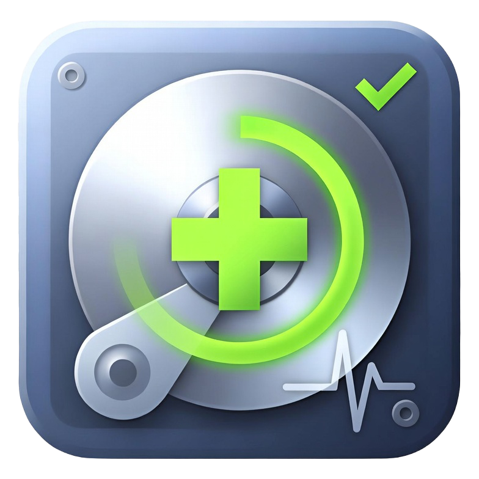

<p align="center">
  
</p>

<h1 align="center">NAS Doctor</h1>

<p align="center">
  <strong>Local NAS diagnostic and monitoring tool.</strong><br>
  Run it as a Docker container on your Unraid, TrueNAS, Synology, or any Linux NAS.<br>
  Beautiful dashboards, Prometheus metrics, webhook alerts — no cloud account required.
</p>

<p align="center">
  <a href="https://buymeacoffee.com/miguelcaetanodias"></a>
</p>

---


NAS Doctor runs periodic health checks on your server — analyzing SMART data, disk usage, Docker containers, kernel logs, temperatures, and Unraid parity — then surfaces findings with clear severity ratings, root-cause correlation, and actionable recommendations.

Born from an [OpenCode diagnostic skill](https://github.com/mcdays94/opencode-server-diagnostic-skill) that generates professional PDF server reports, NAS Doctor packages the same intelligence into a self-hosted app anyone can install.

---

## What It Does

### Diagnostics
- **SMART Health**: Per-drive health, temperature, reallocated sectors, pending sectors, UDMA CRC errors, power-on hours, ATA port mapping
- **Disk Space**: Usage per mount point with color-coded thresholds
- **System**: CPU, memory, load average, I/O wait, uptime, platform detection
- **Docker**: Container listing with CPU/memory per container
- **Network**: Interface speed negotiation, state, MTU
- **Logs**: Filtered dmesg and syslog errors (ATA errors, I/O errors, medium errors)
- **Parity** (Unraid): Historical parity check speed trend analysis, error tracking

### Analysis Engine

15+ diagnostic rules with automatic cross-correlation:

- UDMA CRC errors + slow parity → **Root cause: SATA cable failure**
- High temperatures + slow parity → **Thermal throttling**
- No SSD cache + high I/O wait + Docker containers → **I/O starvation**
- Pending sectors + reallocated sectors → **Failing drive media**
- And more...

### Export Reports

Click **Export Report** in the dashboard to generate a professional, print-ready diagnostic report. Open in your browser and Print → Save as PDF.

<p>
  
</p>

### Integrations

| Integration | How |
|---|---|
| **Prometheus** | Scrape `/metrics` — 30+ gauges for system, disk, SMART, Docker, findings |
| **Grafana** | Connect via Prometheus data source |
| **Discord** | Webhook with rich embeds, severity colors, finding details |
| **Slack** | Webhook with blocks, severity counts, top findings |
| **Gotify** | Native push notifications with priority mapping |
| **Ntfy** | Push notifications with priority and tags |
| **Generic HTTP** | JSON payload with HMAC-SHA256 signing for custom integrations |

---

## Quick Start

### Docker Compose (recommended)

```yaml
services:
  nas-doctor:
    image: ghcr.io/mcdays94/nas-doctor:latest
    container_name: nas-doctor
    privileged: true
    network_mode: host
    volumes:
      - nas-doctor-data:/data
      - /var/run/docker.sock:/var/run/docker.sock:ro
      - /boot:/host/boot:ro
      - /var/log:/host/log:ro
    environment:
      - TZ=Europe/Lisbon
      - NAS_DOCTOR_INTERVAL=6h
      # Optional: webhook notifications
      # - NAS_DOCTOR_WEBHOOK_URL=https://discord.com/api/webhooks/xxx/yyy
      # - NAS_DOCTOR_WEBHOOK_TYPE=discord
    ports:
      - "8080:8080"
    restart: unless-stopped

volumes:
  nas-doctor-data:
```

```bash
docker compose up -d
```

Then open `http://your-nas:8080`.

### Docker Run

```bash
docker run -d \
  --name nas-doctor \
  --privileged \
  --network host \
  -v nas-doctor-data:/data \
  -v /var/run/docker.sock:/var/run/docker.sock:ro \
  -v /boot:/host/boot:ro \
  -v /var/log:/host/log:ro \
  -e TZ=Europe/Lisbon \
  -p 8080:8080 \
  --restart unless-stopped \
  ghcr.io/mcdays94/nas-doctor:latest
```

### Build from Source

```bash
git clone https://github.com/mcdays94/nas-doctor.git
cd nas-doctor
go build -o nas-doctor ./cmd/nas-doctor
./nas-doctor -listen :8080 -data ./data -interval 6h
```

---

## Themes

NAS Doctor ships with 3 dashboard themes. Switch between them from the nav bar.

| Theme | Description |
|---|---|
| **Midnight** (default) | Ultra-dark precision dashboard |
| **Clean** | White, minimal gallery space |
| **Ember** | macOS-native depth, serif typography, micro-animations |

<p>
  
  
</p>
<p>
  
</p>

---

## Configuration

### Environment Variables

| Variable | Default | Description |
|---|---|---|
| `NAS_DOCTOR_LISTEN` | `:8080` | HTTP listen address |
| `NAS_DOCTOR_DATA` | `/data` | SQLite database directory |
| `NAS_DOCTOR_INTERVAL` | `6h` | Diagnostic scan interval (e.g. `1h`, `6h`, `24h`) |
| `NAS_DOCTOR_WEBHOOK_URL` | — | Webhook URL for notifications |
| `NAS_DOCTOR_WEBHOOK_TYPE` | `generic` | `discord`, `slack`, `gotify`, `ntfy`, `generic` |
| `NAS_DOCTOR_WEBHOOK_MIN_LEVEL` | `warning` | Minimum severity to notify: `critical`, `warning`, `info` |

### JSON Config File

For advanced configuration (multiple webhooks, custom host paths):

```bash
nas-doctor -config /data/config.json
```

```json
{
  "listen_addr": ":8080",
  "data_dir": "/data",
  "notifications": {
    "webhooks": [
      {
        "name": "discord-alerts",
        "url": "https://discord.com/api/webhooks/xxx/yyy",
        "type": "discord",
        "enabled": true,
        "min_level": "warning"
      }
    ]
  }
}
```

---

## API Reference

| Endpoint | Method | Description |
|---|---|---|
| `/api/v1/health` | GET | Healthcheck (status, version, uptime) |
| `/api/v1/status` | GET | Server status summary |
| `/api/v1/snapshot/latest` | GET | Full latest diagnostic snapshot |
| `/api/v1/snapshot/{id}` | GET | Specific snapshot by ID |
| `/api/v1/snapshots` | GET | List recent snapshots (last 50) |
| `/api/v1/scan` | POST | Trigger immediate diagnostic scan |
| `/api/v1/report` | GET | Generate print-ready HTML diagnostic report |
| `/api/v1/icons` | GET | List available app icons |
| `/metrics` | GET | Prometheus metrics endpoint |

---

## Prometheus Metrics

All metrics prefixed with `nasdoctor_`. Full list:

<details>
<summary>Expand metric list</summary>

```
# System
nasdoctor_system_cpu_usage_percent
nasdoctor_system_memory_used_bytes / _total_bytes
nasdoctor_system_load_avg_1 / _5 / _15
nasdoctor_system_io_wait_percent
nasdoctor_system_uptime_seconds

# Disks (labels: device, mountpoint, label)
nasdoctor_disk_used_bytes / _total_bytes / _used_percent

# SMART (labels: device, model, serial)
nasdoctor_smart_healthy  (1=passed, 0=failed)
nasdoctor_smart_temperature_celsius
nasdoctor_smart_reallocated_sectors / _pending_sectors
nasdoctor_smart_udma_crc_errors / _power_on_hours

# Docker (labels: name, image)
nasdoctor_docker_container_cpu_percent / _memory_bytes

# Findings
nasdoctor_findings_critical_count / _warning_count
nasdoctor_findings_total{severity="critical|warning|info"}

# Parity (Unraid)
nasdoctor_parity_speed_mb_per_sec / _duration_seconds

# Collection
nasdoctor_collection_duration_seconds
nasdoctor_last_collection_timestamp
```

</details>

---

## Supported Platforms

| Platform | Status | Notes |
|---|---|---|
| **Unraid** | ✅ Full support | Parity analysis, array status, disk labels |
| **TrueNAS SCALE** | ✅ Supported | ZFS pool detection planned |
| **Synology DSM** | ✅ Supported | Via Docker / Container Manager |
| **QNAP QTS** | ✅ Supported | Via Container Station |
| **Proxmox** | ✅ Supported | ZFS + LVM detection planned |
| **Generic Linux** | ✅ Supported | Any distro with Docker |

---

## Resource Usage

NAS Doctor is designed to be invisible on your system:

| Resource | During scan (~15s every 6h) | Between scans |
|---|---|---|
| **CPU** | <2% | ~0% |
| **Memory** | ~30-50 MB | ~30-50 MB |
| **Disk I/O** | Read-only: `/proc`, `smartctl`, `dmesg` | Zero |
| **Network** | Zero external calls | Serves UI only when accessed |

---

## Demo Mode

Preview all themes with realistic mock data (no NAS needed):

```bash
go build -o nas-doctor ./cmd/nas-doctor
./nas-doctor -demo -listen :8080
```

---

## Icons

NAS Doctor ships with 3 app icons. The default is **icon3**.

<p>
   &nbsp;
   &nbsp;
  
</p>

Available at `/icons/icon1.png`, `/icons/icon2.png`, `/icons/icon3.png`.

---

## Roadmap

- [ ] Historical trend charts (sparklines in dashboard)
- [x] Config UI in dashboard (manage webhooks, scan interval, theme, icon selection)
- [x] Unraid Community Apps template
- [ ] GitHub Actions CI for multi-arch Docker builds (amd64/arm64)
- [x] PDF report export (Clean theme styled, print-ready)
- [x] Custom scan frequency with full granularity
- [x] Dynamic scheduler interval updates (no restart required)
- [x] Settings page inherits active theme
- [ ] Log Forwarding (export to external logging endpoints)
- [ ] ZFS pool health detection
- [ ] Optional cloud AI integration for deep root-cause analysis

---

## License

MIT

---

## Support This Project

If NAS Doctor saves you from a dead drive or helps you sleep better knowing your server is healthy:

[](https://buymeacoffee.com/miguelcaetanodias)
